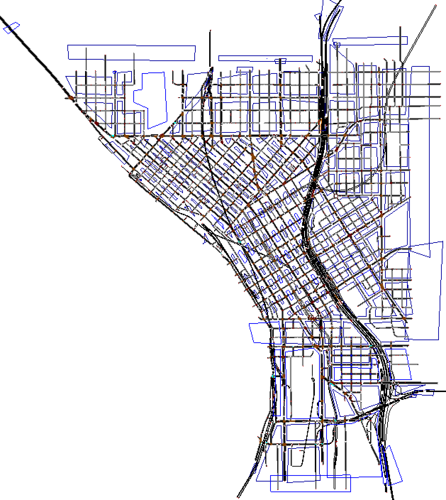

# Simulation of Downtown Seattle AM peak
In this work, we simulated passenger vehicles and public transportation of Downtown seattle between 5 to 10 AM. The exact simulation period could be modified in step3 of demand generation. 
Our network includes south of Mercer St, west of 12th Ave, and north of S Holgate St.

- A more detailed documentation will be linked soon. 
- This work was based upon the simulation in
https://github.com/Yiran6/MatSumo (private repo). It also included pedestrians. That simulation could be found in `old files` folder.

## Demand generation
Demand generation takes place in three steps:
- **Step1: Trip generation**
  - Run `step1-read h5.ipynb`
    - In this step, 
  
- **Step2: TAZ calibration**
  - Run `step2-taz filteration_conversion-v.2.ipynb`
    - Here, 
  
- **Step3: Route file (SUMO input) generation**
  - Run `step3-generate_rou.ipynb`
    - In the final step for demand generation, 
    - Remember: if you use the first method (od2trips), make sure that you are using the exact TAZ file used in the simulation (in case you change something in this file in `simulation` folder and want to generate demand in `Demand generation` folder) 
    - If you decide to change the hours to something else rather than 5-10am, remove additional demand of public transit in `bus_link_route.rou.xml` and replace it with 
    `new_bus_link_route.rou.xml` in `clean corrected inputs` folder.
    
- **Step4: Make little adjustments**
  - Run `misc.ipynb` in `simulation` folder.
    - Use it after generating the demand file and copying it into `simulation` folder.
    - 
## Simulation
To run the simulation, you have to:
1) Have SUMO installed on your system.
2) Install python packages in `requirements.txt`
3) Run `run_simulation.py` file
4) Find the output results in "new output" folder.

- Some of the signals in `offset_signal_Seattle_network_reformed connections2.net.xml` were manually changed. 
To use the original specification of traffic signals, use 
`no_alley_Seattle_network_reformed connections.net.xml` instead. Note that this network probably won't work well with 
route files generated with od2trips.
